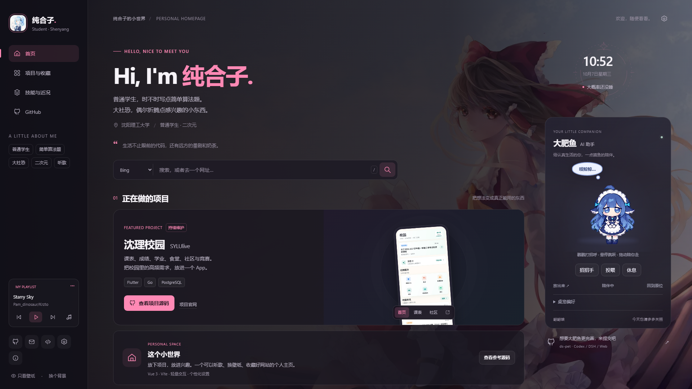

# 纯合子的个人主页

放下项目，放进兴趣。一个可以听歌、换壁纸、逛收藏，也有大肥鱼陪着摸鱼的个人主页。

基于 **Vue 3 + Vite**，支持桌面与手机，可部署到 Cloudflare Pages 等静态托管平台。

[功能](#功能) · [本地运行](#本地运行) · [部署与导出](#部署与导出) · [大肥鱼桌宠](#大肥鱼桌宠) · [参与改进](#参与改进)



## 功能

- **个人空间**：项目介绍、应用截图切换、网站收藏、技能仓库与生活近况。
- **外观与搜索**：主题色、壁纸、亮度、模糊、只看壁纸模式，以及多搜索引擎切换。
- **音乐**：歌单、播放进度、歌词、音量和本地音频；点击播放后才加载音频。
- **大肥鱼桌宠**：点击招手、悬停跳跃、视线跟随、投喂、休息、拖动和出窝 / 回窝。
- **适配与可访问性**：窄屏布局、键盘操作、减少动态效果，以及不依赖外部图片和音乐请求的首屏展示。

## 本地运行

建议使用 Node.js 22 或更高版本。

```bash
git clone https://github.com/zhouwu97/claawqianduan.git
cd claawqianduan
npm ci
npm run dev
```

打开终端打印的本地地址。构建后可通过 `npm run preview` 检查发布效果。

## 部署与导出

### 静态网站

```bash
npm run build
```

将生成的 `dist/` 发布到静态托管平台。Cloudflare Pages 配置：

| 配置项 | 值 |
| --- | --- |
| 构建命令 | `npm run build` |
| 输出目录 | `dist` |

### 单文件 HTML

```bash
npm run export:html
```

生成 `dist/chunhezi_home.html`，内嵌图片、样式、桌宠和脚本，可直接打开或分享。在线音乐和外部链接仍需网络连接。

## 个性化配置

在 [`src/config.js`](src/config.js) 修改名称、简介、标签、页面描述与默认歌单；构建时也可通过 `VITE_CONFIG` 传入 JSON 覆盖配置。未提供的字段保留默认值，例如 `.env.local`：

```dotenv
VITE_CONFIG='{"name":"你的名字","hero":{"intro":"欢迎来到我的小世界。"}}'
```

项目卡片与外链位于 [`src/layouts/HomeShell.vue`](src/layouts/HomeShell.vue)，图片映射位于 [`src/assets.json`](src/assets.json)。

### 音乐来源

默认使用共享 Meting 接口，提供初始歌单与浏览器缓存。可在音乐设置中连接自己的完整歌单接口，或选择本地音频；本地文件仅在当前浏览器播放，不上传。

播放器会处理加载超时、播放被浏览器拒绝、快速切歌和来源切换。第三方音源受版权、地区和服务状态影响，不可用时可换歌或选择本地音频。

## 大肥鱼桌宠

角色与独立组件来自 [ds-pet · 大肥鱼 / 鲸鲸娘](https://github.com/zhouwu97/ds-pet)。这是纯交互桌宠，无需模型接口。

| 操作 | 效果 |
| --- | --- |
| 点击人物 / 招招手 | 挥手打招呼 |
| 悬停 / 投喂 | 跳跃互动 |
| 鼠标或触摸拖动 | 左右奔跑，气泡跟随人物左上方 |
| 休息 / 唤醒 | 切换休息状态 |
| 放出来 | 只有人物和气泡出窝，卡片与控件留在原处 |
| 召回 / 双击 / 右键人物 | 跑回小窝并招手 |
| 方向键 / Escape | 微调位置 / 人物聚焦时回窝 |

出窝、回窝带短暂过渡，拖动可以打断；系统减少动态效果或键盘触发时直接切换位置。主题与交互偏好保存在当前浏览器。

<details>
<summary>从桌宠仓库同步组件</summary>

在本仓库根目录执行：

```bash
git clone https://github.com/zhouwu97/ds-pet.git ../ds-pet
node scripts/sync-pet.mjs ../ds-pet
```

同步脚本会先核对精灵图 SHA-256，再复制 Web 组件、共享动作定义、素材与 MIT 许可。同步后重新构建即可，不需要把另一个仓库部署到网站服务器。

</details>

## 开发与验证

```bash
npm test
npx playwright install chromium
npm run test:e2e
npm run build
```

单元测试覆盖播放器状态、超时、回退和异步竞态；浏览器测试覆盖媒体播放、独立 HTML、响应式布局，以及桌宠出窝、回窝、拖动和壁纸模式。音乐测试使用本地生成的 WAV 数据，避免依赖第三方音源。

| 路径 | 职责 |
| --- | --- |
| `src/layouts/HomeShell.vue` | 页面结构、内容与弹窗 |
| `src/homeApp.js` | 外观、搜索、导航与页面交互 |
| `src/styles/home.css` | 桌面 / 手机样式与动画 |
| `src/music/` | 播放器、歌单与音乐界面 |
| `src/assistant.js`、`src/pet/` | 桌宠接入与独立组件 |
| `scripts/export-html.mjs` | 单文件 HTML 导出 |
| `tests/` | 单元与浏览器测试 |

## 参与改进

欢迎在 [Issues](https://github.com/zhouwu97/claawqianduan/issues) 提交问题或建议，也欢迎 Pull Request。界面问题请附上窗口宽度、操作步骤和截图。

想要大肥鱼更完善，来 [ds-pet](https://github.com/zhouwu97/ds-pet) 提交吧。桌宠素材与组件采用 MIT 许可，分发时保留 [`public/img/assistant/LICENSE`](public/img/assistant/LICENSE)。

原项目灵感来自 [leleo886](https://github.com/leleo886)。
